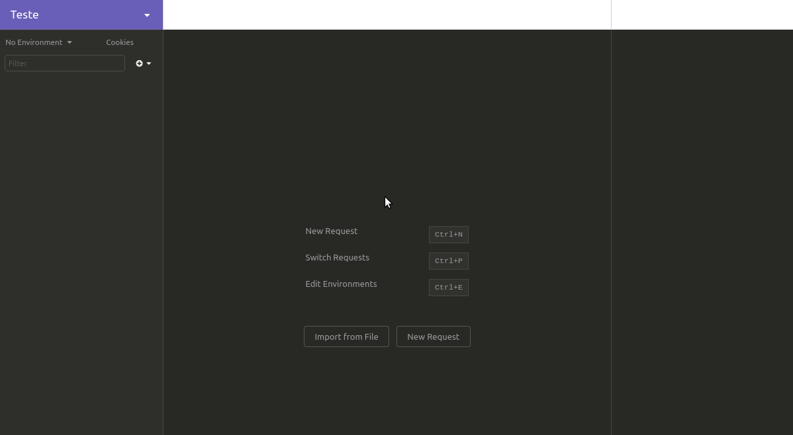

# CaronaPraAula (caronaSA)

CaronaPraAula é um sistema de caronas coletivas para instituições de ensino, feito para ser um PWA totalmente responsivo. 

Este sistema foi apresentado na 2ª Situação de Aprendizagem do curso técnico em Desenvolvimento de Sistemas do SENAI/SC, em Florianópolis.

### Demo 
 - https://sa-carona.herokuapp.com/
 - Login: a@a.com
 - Senha: 00000000
 
### Funcionalidade

Neste sistema, existem dois tipos de usuários: os motoristas, alunos com carro que querem gente para "rachar" gasolina; e os "caroneiros", alunos que querem ir de carro pra aula. O sistema cadastra os usuários de forma única e dá a opção pro usuário criar uma carona ou encontrar uma carona. 

Ao criar uma carona, o usuário registra um destino e um horário de partida para este destino. O sistema, então, cria um "pin" com as informações do usuário e da carona em um mapa da Here.

Em contrapartida, o usuário também pode buscar uma carona. Ele vai colocar o destino, raio de busca e horário preferido e o sistema vai retornar o mapa da Here com todos os motoristas com destino e horário em comum ao buscado.

### Passos para instalação

- Na pasta do projeto, executar um `yarn` (ou `npm i`) pelo terminal, para baixar todas as dependencias
- Criar um arquivo na pasta raiz chamado `.env` preenchendo-o com o conteúdo do `.env.example`
- Executar o comando `yarn dev` (ou `npm run dev`), no terminal, para inicializar o servidor

  #### Caso for usar outro banco de dados

- Executar a instalação do PostGis via Query no seu banco: `create extension postgis`
- Comando para executar as migrations: `yarn sequelize db:migrate`

**Utilize o arquivo `Workspace-CaronaSA.json` para realizar a importação do Workspace para o [Insomnia](https://insomnia.rest/). Siga os passos abaixo para a importação**

